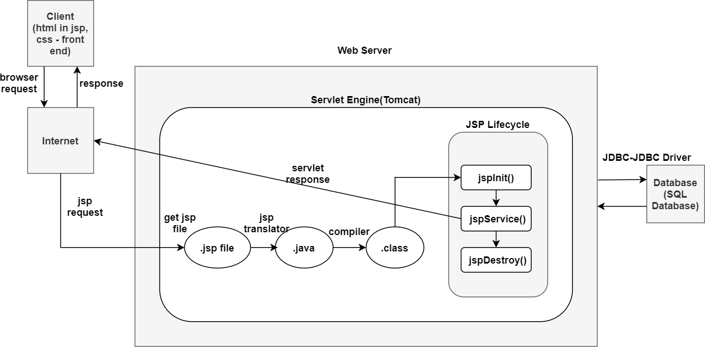

# Description: #
This project is a basic implementation of an e-commerce website.
Technologies and languages used are jsp, css, html, SQL database , JDBC API and Tomcat server.

# Architechture: #
The application follows a typical jsp architechture as shown in the image below.

# Entity Relationship diagrams: #
The ER diagrams for all the DB tables is shown below.

# Admin workflow: #
Application supports two kinds of administrators. 
System admin and product admin, system admin manages the system users 
and product admin manages the products listed in the system. 
A glimpse of admin dashboard and product admin dashboard is shown below.

#### Complete admin workflow: ####	 
Default login credentials for an admin employee are admin/admin123).

# End-user workflow: #
A glimpse of consumer workflow is shown below.

	
#### Complete end-user workflow: ####	 

#### Administration employee operations include: #### 
* Adding new employees belonging to different departments to the system
#### Employee in products department workflow include: ####
* Adding different categories in products
* Adding products belonging to different categories to the system(Note: images for added products must be placed in docbase folder/build/web folder and just the jpeg file name must be entered on screen)
* Adding products to bestselling list manually.

#### End-user workflow includes the following operations: ####
* New user registration 
* Existing user login 
* Browse through products in each category.
* Browse through the best selling items.
* Add to cart and checkout.

# Installation guide: #
####  Code base: ####
* Clone the project from git and download it to your local machine.
####  Database: ####
* Download, install and set up SQL Server management studio.
* Open the SQL Server management studio and Right click on 'Databases' and click on 'New Database'.
* Enter any DB name and click OK.
* In the docbase directory, go to createDBScript.sql file, copy all the sql statements in createDBScript.sql file.
* Navigate back to SQL Server management studio and right click on the create DB name-> New query, paste the copied sql statements
	 and click on execute.
####  Tomcat: ####
* Make sure tomcat is installed on your machine. If not installed download the latest version from here - https://tomcat.apache.org/download-80.cgi
* In the docbase directory navigate to tomcat folder and copy the file Shopping_project.xml.
* Go to tomcat directory Navigate to conf->Catalina->localhost(Create Catalina and localhost folders if needed) and paste the copied file here.
* Get sqljdbc4-2.0.jar and paste it in lib folder.
* Open Shopping_project.xml in any editor replace ${DOCBASE-PATH} with the local path where the source code is downloaded from git. (point it to web folder ex: "C:\Users\saiv0001\Documents\NetBeansProjects\Shopping_project\web").
####  Configure Database and Server details: ####
* In the downloaded code base navigate to web/WEB-INF/web.xml. Open web.xml in notepad
* Replace ${DB_URL} with the created DB URL 
* Replace ${username} with the created DB username  
* Replace ${password} with the created DB password.
* Navigate to downloaded doc base folder/web/index.html , open index.html in notepad replace '${hostname}' with the hostname ex:     localhost.
* Open tomcat folder/conf/server.xml. Search for HTTP/1.1 connector port. 
* In index.html replace {portnum} with the http port number.
####  Start up the application ####
* Navigate to tomcat folder / bin folder, double click startup.bat. make sure tomcat is up and running without any errors.
* Go to any browser and load the URL http://${hostname}:${port number}/Shopping_project/index.html. Ex: http://localhost:8180/Shopping_project/index.html.

	
